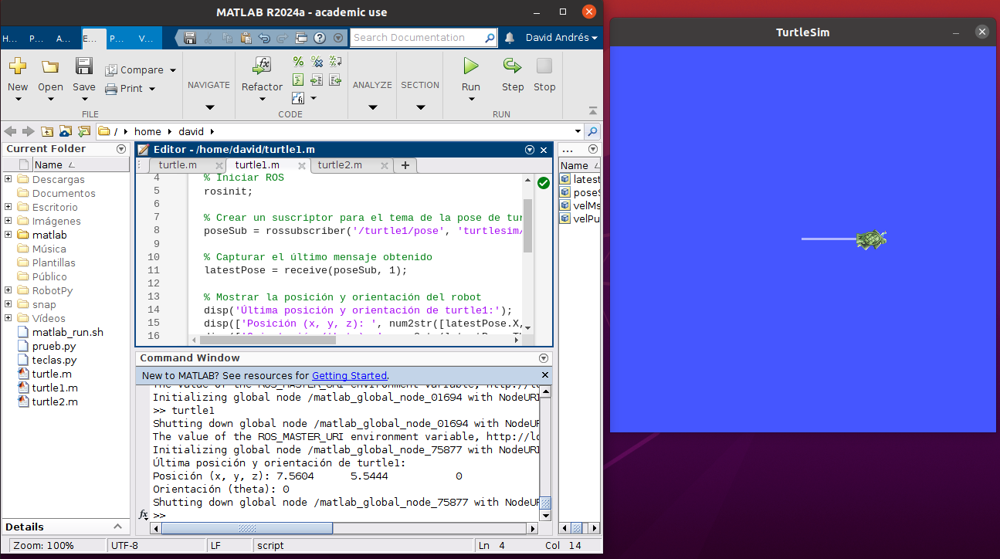
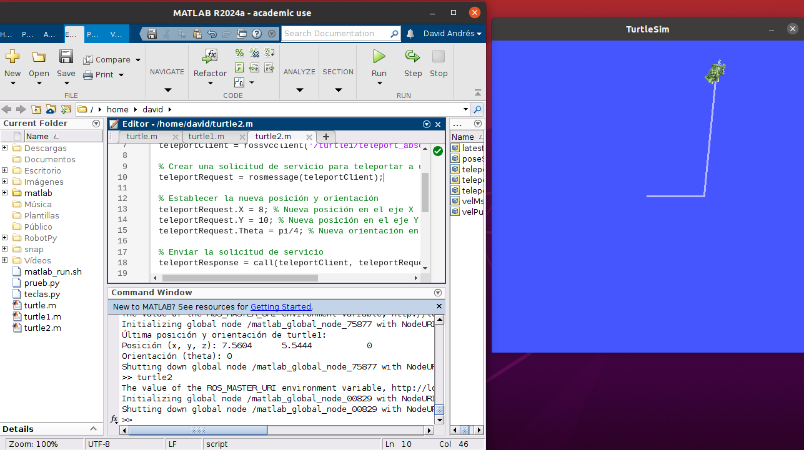

# Laboratorio 3 de Robótica: Desarrollo e Introducción a ROS

- David Andrés Ricaurte de Lima  
  Ingeniería Mecatrónica  
  Universidad Nacional de Colombia  
  Bogotá, Colombia  
  dricaurte@unal.edu.co

- Juan Antonio Rojas Cobos  
  Ingeniería Mecatrónica  
  Universidad Nacional de Colombia  
  Bogotá, Colombia  
  juarojascog@unal.edu.co

Este laboratorio tiene como principal objetivo de adquirir conocimientos y habilidades referentes a los conceptos básicos de ROS(Robot Operating System), a los comandos fundamentales de ROS, a la conexión de nodos de ROS y Matlab y a la conexión inicial de motores Dynamixel con ROS. Brindando así una introducción practica a ROS,a la interacción de este con Matlab y a la conexión de motores Dynamixel proporcionando una base sólida para trabajar en proyectos de robótica y de desarrollo de sistemas robóticos.

## Descripción de la Solución Planteada Matlab

Primer Script: https://github.com/dricaurte29/LAB3_Robotica-2024-1/blob/5e2bddc1a95a71f3d0e96a30c07e136c9d061fca/scriptsMatlab/turtle.m
En este código, se inicializa ROS, crea un publicador para enviar comandos de velocidad para el control de la tortuga, establece una velocidad lineal en 2, envia el comando de velocidad y luego realiza una pausa durante 1 segundo.

Segundo Script: https://github.com/dricaurte29/LAB3_Robotica-2024-1/blob/5e2bddc1a95a71f3d0e96a30c07e136c9d061fca/scriptsMatlab/turtle1.m
En este código se realiza una conexión conROS, se obtiene información referente a la posición y orientación de la tortuga y luego cierra la conexión con ROS.

Tercer Script: https://github.com/dricaurte29/LAB3_Robotica-2024-1/blob/5e2bddc1a95a71f3d0e96a30c07e136c9d061fca/scriptsMatlab/turtle2.m
En este código se establece una conexión con ROS, se utiliza un servicio para teleportar la tortuga a una nueva posición y orientación, y luego se cierra la conexión con ROS.

## Descripción de la Solución Planteada Python

Script: https://github.com/dricaurte29/LAB3_Robotica-2024-1/blob/5e2bddc1a95a71f3d0e96a30c07e136c9d061fca/scriptsPython/myTeleopKey.py

Este código se encarga de controlar un robot tortuga en el entorno ROS desde python mediante entradas de teclado:
- W: Movimiento hacia adelante
- S: Movimiento hacia atrás
- A: Rotación antihoraria
- D: Rotación horaria
- R: Regrasar a posición y orientación central
- SPACE: Girar 180

En el siguiente video se aprecia el funcionamiento de este código:
https://youtu.be/DN9ZJ2M9to4
